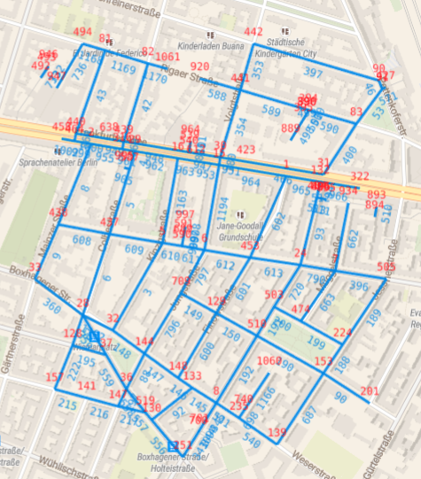

# Graphhopper Graphtool Prototype

## Setup

First you need to start a modified Graphhopper server that provides the current graph.
```bash
git clone git://github.com/easbar/graphhopper.git
cd graphhopper
git checkout graphtool
./graphhopper.sh -a web -i europe_germany_berlin.pbf
```

Then in a separate location checkout this repository
```bash
git clone git://github.com/easbar/graphhopper-graphtool.git
```
You need to create an account at `https://www.maptiler.com/cloud/`,
start a local openmaptiles server (`https://openmaptiles.org/docs/website/mapbox-gl-js/`) or similar and configure
the map tiles and graphhopper urls in `src/config.js`.
Then run: 

```bash
cd deck.gl
npm install
npm run watch
```

This should start webpack-dev-server (default is http://localhost:8080).
When you make changes to the code the server should refresh automatically without
reloading the page. 

Here is a screenshot: 

So far this app is only tested with Chrome 69-72.


